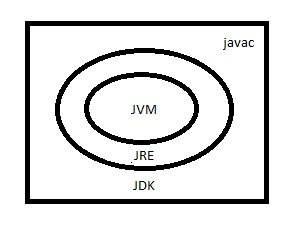

### What is JAVA?
Java is a versatile, high-level programming language known for its platform independence, object-oriented approach, and robustness. It allows developers to write code that can run on various platforms, making it a popular choice for building applications ranging from web and mobile to enterprise software.

### Features of Java
1. Platform independence (Write Once, Run Anywhere)
2. Object-oriented programming
3. Strongly typed language
4. Automatic memory management (Garbage Collection)
5. Rich standard library
6. Multithreading and concurrency support
7. Exception handling
8. Security features (sandboxing)
9. Dynamic class loading
10. Robustness and error-checking at compile and runtime.
11. Information processed like bytecode.
12. Contain its all previous version. 

### Hiererchical View of JVM, JRE, JDK 

### Reserved words or keywords in Java

There are about 54 reserved words in Java. [Click here](https://www.w3schools.com/java/java_ref_keywords.asp) for details.

### Syntax and Semantics
Syntax = Structure and format of code.  
Semantics = Meaning and behavior of code.

### Home Work

1. Learn history of JAVA.
2. Write a JAVA program "Hello World" in notepad and execute with command line.
